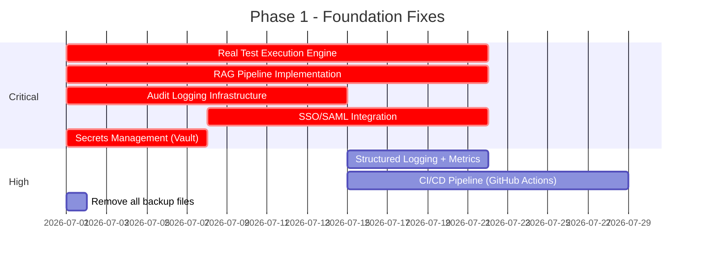

# Enterprise STLC Platform — Module-by-Module Gap Analysis

> **Reviewed by**: AI Solution Architect / Telecom Architect / STLC Process Expert  
> **Date**: June 14, 2026  
> **Platform Maturity**: ~52% — Functional demo, NOT enterprise-ready  
> **Benchmark**: HP ALM/Octane, Azure DevOps Test Plans, Tricentis Tosca, Micro Focus UFT, Xray for Jira

---

## Executive Summary

The STLC platform demonstrates a well-conceived architecture (FastAPI + Next.js + PostgreSQL + Redis/Celery + LangGraph agents) with telecom-domain awareness as a core differentiator. However, **critical structural gaps** across 14 modules prevent enterprise readiness. The most damaging deficiency is the **100% simulated test execution engine** — the single module that gives an STLC platform its credibility is entirely fictitious. Combined with an incomplete RAG pipeline (8%), absent CI/CD integration, no environment management, and no audit logging infrastructure, the platform cannot be positioned against incumbents without a 6-9 month remediation program.

### Overall Maturity Heatmap

| Module | Current | Target | Severity | Blocking? |
|---|:---:|:---:|:---:|:---:|
| 🔴 Test Execution | 5% | 90% | **CRITICAL** | Yes — all evidence is fake |
| 🔴 RAG Pipeline | 8% | 85% | **CRITICAL** | Yes — agents hallucinate |
| 🔴 CI/CD & DevOps | 0% | 80% | **CRITICAL** | Yes — no pipeline integration |
| 🔴 Environment Mgmt | 0% | 75% | **CRITICAL** | Yes — telecom-essential |
| 🟠 Automation | 30% | 85% | **HIGH** | Yes — generated but unrunnable |
| 🟠 Test Planning | 35% | 80% | **HIGH** | Partial |
| 🟠 Reports & Analytics | 35% | 85% | **HIGH** | Partial |
| 🟠 Observability | 10% | 80% | **HIGH** | Yes — no production visibility |
| 🟡 Requirements | 45% | 85% | **MEDIUM** | No |
| 🟡 Defect Management | 55% | 85% | **MEDIUM** | No |
| 🟢 Jira Integration | 80% | 90% | **LOW** | No |
| 🟢 Traceability (Backend) | 80% | 90% | **LOW** | No |
| 🟡 Traceability (Frontend) | 15% | 85% | **HIGH** | Yes — backend unused |
| 🟡 Security & Compliance | 40% | 90% | **HIGH** | Yes — enterprise blocker |

---

## Module 1: Test Execution Engine

> **Current**: 5% | **Target**: 90% | **Severity**: 🔴 CRITICAL

> [!CAUTION]
> The execution module is **100% LLM-simulated**. The `TestExecutionAgent` in [execution_agent.py](file:///c:/Test_AI_Agents/Test_AI_Agents/stlc-platform/backend/app/agents/execution/execution_agent.py) asks an LLM to generate fictional pass/fail results with fabricated error messages. **No actual test is ever executed.** This single gap makes the entire platform's metrics, reports, traceability, and release readiness features meaningless.

### Current State
- [execution_agent.py](file:///c:/Test_AI_Agents/Test_AI_Agents/stlc-platform/backend/app/agents/execution/execution_agent.py): LLM generates results with hardcoded ~70/20/10 pass/fail/skip distribution
- [execution_service.py](file:///c:/Test_AI_Agents/Test_AI_Agents/stlc-platform/backend/app/services/execution_service.py): Only 50 lines — just list/get CRUD, no orchestration
- No test runner integration (Playwright, Pytest, Robot Framework, Selenium, Appium)
- No JUnit/TestNG XML/JSON result parser
- No real-time execution streaming
- No parallel execution, retries, or flaky test detection

### Enterprise Gaps

| Gap | Impact | Priority |
|---|---|---|
| No actual test runner integration | All evidence is fabricated | P0 |
| No JUnit/xUnit/Allure result ingestion API | Cannot consume CI/CD results | P0 |
| No test execution queue/scheduler | Cannot manage execution at scale | P0 |
| No environment-aware execution | Telecom requires SIT→UAT→Prod validation | P0 |
| No parallel execution support | Thousands of test cases = hours serial | P1 |
| No retry/re-run for failed tests | Manual overhead | P1 |
| No flaky test detection & quarantine | False positives poison metrics | P1 |
| No execution evidence (screenshots, video, HAR) | Compliance requires proof | P1 |
| No real-time execution progress WebSocket | Poor UX for large suites | P2 |
| `real_test_execution` config flag exists but has no implementation | Dead feature toggle | P2 |

### Remediation
1. Build result ingestion REST API (`POST /api/v1/execution/ingest`) accepting JUnit XML, Allure JSON, and custom formats
2. Build webhook receiver for CI/CD pipelines (Jenkins, GitLab CI, Azure DevOps)
3. Integrate Playwright/Pytest subprocess runner for native execution
4. Add execution scheduler with environment+priority queuing
5. Implement flaky test detection (3-run rolling window)

---

## Module 2: RAG Pipeline (Retrieval-Augmented Generation)

> **Current**: 8% | **Target**: 85% | **Severity**: 🔴 CRITICAL

> [!CAUTION]
> The `RequirementChunk` table exists ([requirement.py](file:///c:/Test_AI_Agents/Test_AI_Agents/stlc-platform/backend/app/models/requirement.py#L125-L139)), pgvector is installed, but there is **no embedding service, no vector column, no similarity search, and no RAG retrieval** in any agent. All 9+ agents generate output purely from their system prompt + user input, with zero grounding in project artifacts. This means every telecom-specific detail (interface names, system IDs, protocol references) is hallucinated.

### Current State
- `RequirementChunk` model: has `chunk_text` and `token_count` but **no embedding vector column**
- pgvector extension enabled in Docker (`pgvector/pgvector:pg16`) but unused
- No embedding generation service (no OpenAI Ada, no sentence-transformers)
- No vector similarity search function
- No chunking strategy for requirements, test plans, or defects
- No RAG context injection in any agent prompt

### Enterprise Gaps

| Gap | Impact | Priority |
|---|---|---|
| No embedding vector column on RequirementChunk | Cannot store embeddings | P0 |
| No embedding generation service | Cannot vectorize content | P0 |
| No similarity search API | Cannot retrieve relevant context | P0 |
| No RAG context injection in agent prompts | All generation is ungrounded | P0 |
| No cross-artifact chunking (test cases, defects, specs) | Limited retrieval scope | P1 |
| No embedding cache/refresh strategy | Stale vectors | P1 |
| No telecom knowledge base integration (3GPP, ETSI specs) | Missing domain grounding | P1 |
| No RAG evaluation metrics (faithfulness, relevance) | Cannot measure RAG quality | P2 |

### Remediation
1. Add `Vector(1536)` column to `RequirementChunk` using pgvector
2. Build `EmbeddingService` supporting OpenAI text-embedding-3-small and local alternatives
3. Build `RAGRetrievalService` with hybrid search (semantic + keyword BM25)
4. Inject top-K retrieved chunks into every agent's system prompt as `<context>` block
5. Build telecom knowledge base from 3GPP/ETSI specification PDFs

---

## Module 3: CI/CD & DevOps Integration

> **Current**: 0% | **Target**: 80% | **Severity**: 🔴 CRITICAL

> [!WARNING]
> There is **zero CI/CD pipeline integration**. No GitHub Actions, no Jenkins plugin, no GitLab CI webhook, no Azure DevOps pipeline. For an STLC platform, this means the testing lifecycle is completely disconnected from the development lifecycle.

### Enterprise Gaps

| Gap | Impact | Priority |
|---|---|---|
| No CI/CD pipeline trigger/webhook API | Cannot integrate with DevOps | P0 |
| No pipeline status dashboard | No visibility into build+test status | P0 |
| No SCM integration (Git commit → test impact) | No change-aware testing | P1 |
| No artifact repository integration | Cannot link builds to test results | P1 |
| No deployment verification testing | Cannot validate deployments | P1 |
| No pipeline templates/recipes for telecom | Must configure from scratch | P2 |

---

## Module 4: Environment Management

> **Current**: 0% | **Target**: 75% | **Severity**: 🔴 CRITICAL

> [!WARNING]
> Telecom enterprises operate across 6-10 test environments (DEV, SIT, SIT2, UAT, Pre-Prod, Staging, Performance, DR, Production). There is **no environment model, no environment health monitoring, no environment booking/scheduling, and no environment-to-test-run linkage**. The `environment` field on [ExecutionRun](file:///c:/Test_AI_Agents/Test_AI_Agents/stlc-platform/backend/app/models/execution.py#L24) is just a free-text string.

### Enterprise Gaps

| Gap | Impact | Priority |
|---|---|---|
| No Environment data model | Cannot manage test environments | P0 |
| No environment health check/monitoring | Test failures conflated with env issues | P0 |
| No environment booking/calendar | Conflicts between teams | P1 |
| No environment configuration management | Manual setup errors | P1 |
| No test data ↔ environment linkage | Wrong data in wrong env | P1 |
| No environment provisioning automation | Slow environment setup | P2 |

---

## Module 5: Requirements Management

> **Current**: 45% | **Target**: 85% | **Severity**: 🟡 MEDIUM

### Strengths
- Rich telecom domain fields (22+ fields) added via migrations on [requirement.py](file:///c:/Test_AI_Agents/Test_AI_Agents/stlc-platform/backend/app/models/requirement.py)
- AI intake agent ([intake_agent.py](file:///c:/Test_AI_Agents/Test_AI_Agents/stlc-platform/backend/app/agents/requirement/intake_agent.py)), quality agent, enrichment agent
- Quality scoring with per-dimension breakdown
- Jira sync with bidirectional field mapping
- Document upload and URL capture for requirement ingestion

### Enterprise Gaps

| Gap | Impact | Priority |
|---|---|---|
| No requirement versioning/history | Cannot track requirement evolution | P0 |
| No diff view between requirement versions | No change visibility | P1 |
| Backup files polluting codebase ([requirement_bkp.py](file:///c:/Test_AI_Agents/Test_AI_Agents/stlc-platform/backend/app/models/requirement_bkp.py), [requirement_bkp1.py](file:///c:/Test_AI_Agents/Test_AI_Agents/stlc-platform/backend/app/models/requirement_bkp1.py), [quality_agent_bkp.py](file:///c:/Test_AI_Agents/Test_AI_Agents/stlc-platform/backend/app/agents/requirement/quality_agent_bkp.py)) | Code quality/maintenance | P1 |
| No requirement dependency graph | Cannot model inter-requirement relationships | P1 |
| No bulk import from Excel/CSV/Confluence | Enterprise data migration blocked | P1 |
| No requirement baseline/snapshot per release | Cannot freeze scope | P1 |
| Quality score exists but no automated gating | Low-quality reqs flow downstream | P1 |
| No collaborative editing (comments, @mentions) | Team workflow broken | P2 |
| No natural language duplicate detection | Redundant requirements | P2 |
| `readiness_status` field not enforced as gate for test planning | Unready reqs generate tests | P1 |

---

## Module 6: Test Planning & Scenario Generation

> **Current**: 35% | **Target**: 80% | **Severity**: 🟠 HIGH

### Current State
- [planning_agent.py](file:///c:/Test_AI_Agents/Test_AI_Agents/stlc-platform/backend/app/agents/test_planning/planning_agent.py) generates test plans from requirements
- [scenario_agent.py](file:///c:/Test_AI_Agents/Test_AI_Agents/stlc-platform/backend/app/agents/test_planning/scenario_agent.py) generates test scenarios
- [test_case_agent.py](file:///c:/Test_AI_Agents/Test_AI_Agents/stlc-platform/backend/app/agents/test_planning/test_case_agent.py) generates test cases with steps
- [test_plan_service.py](file:///c:/Test_AI_Agents/Test_AI_Agents/stlc-platform/backend/app/services/test_plan_service.py) has orchestration

### Enterprise Gaps

| Gap | Impact | Priority |
|---|---|---|
| No test estimation (effort hours, complexity scoring) | Cannot plan capacity | P0 |
| No test cycle / test sprint management | Cannot organize execution by sprint | P0 |
| No test suite grouping (regression, smoke, sanity) | Cannot manage test portfolios | P1 |
| No risk-based test selection (execute critical first) | Inefficient resource use | P1 |
| No test plan approval workflow with SLA | Plans sit in draft indefinitely | P1 |
| No test case parameterization / data-driven testing | Duplicated test cases | P1 |
| No test case re-usability across projects | Siloed test knowledge | P2 |
| No impact analysis (requirement change → affected tests) | Blind to scope changes | P1 |
| Agent prompts not telecom-domain aware | Generic test scenarios | P1 |
| No manual/exploratory testing workflow | Only automated path exists | P2 |

---

## Module 7: Automation Script Generation

> **Current**: 30% | **Target**: 85% | **Severity**: 🟠 HIGH

### Current State
- [automation_agent.py](file:///c:/Test_AI_Agents/Test_AI_Agents/stlc-platform/backend/app/agents/automation/automation_agent.py) generates Playwright/Pytest scripts via LLM
- [automation_service.py](file:///c:/Test_AI_Agents/Test_AI_Agents/stlc-platform/backend/app/services/automation_service.py) manages script CRUD and mapping
- Scripts are generated and stored but **never executed**

### Enterprise Gaps

| Gap | Impact | Priority |
|---|---|---|
| Generated scripts are never validated/compiled | May produce syntactically invalid code | P0 |
| No script execution sandbox | Cannot verify generated scripts | P0 |
| No Page Object Model (POM) generation | Unmaintainable scripts | P1 |
| No API test generation (REST/SOAP/gRPC) | Only UI tests, missing API layer | P1 |
| No telecom protocol testing (SS7, Diameter, SIP, SOAP) | Core telecom gap | P0 |
| No script versioning in Git | Cannot track script evolution | P1 |
| No code review/linting for generated scripts | Quality unknown | P1 |
| No framework-agnostic generation (only Playwright) | Limited adoption | P2 |
| No test data binding in generated scripts | Hardcoded values | P1 |
| No parallel execution configuration | Scalability gap | P2 |

---

## Module 8: Defect Management

> **Current**: 55% | **Target**: 85% | **Severity**: 🟡 MEDIUM

### Strengths
- [defect_agent.py](file:///c:/Test_AI_Agents/Test_AI_Agents/stlc-platform/backend/app/agents/defect/defect_agent.py) generates defect drafts from failed executions
- Jira push capability via [jira_service.py](file:///c:/Test_AI_Agents/Test_AI_Agents/stlc-platform/backend/app/services/jira_service.py)
- Defect-to-execution-result traceability

### Enterprise Gaps

| Gap | Impact | Priority |
|---|---|---|
| No defect lifecycle management (New→Open→In Progress→Fixed→Verified→Closed) | Basic workflow missing | P0 |
| All defects are simulated (from fake execution results) | Fictitious defect data | P0 |
| No defect severity/priority matrix with SLA | No SLA compliance tracking | P1 |
| No duplicate defect detection | Noise in defect backlogs | P1 |
| No defect clustering/classification by root cause | No actionable insights | P1 |
| No re-test workflow (defect fixed → re-execute failed test) | Manual process | P1 |
| No defect aging/escalation rules | SLA breaches undetected | P2 |
| No defect dashboard with burn-down charts | Limited visibility | P2 |

---

## Module 9: Reports & Analytics

> **Current**: 35% | **Target**: 85% | **Severity**: 🟠 HIGH

### Current State
- [report_service.py](file:///c:/Test_AI_Agents/Test_AI_Agents/stlc-platform/backend/app/services/report_service.py): **Only 20 lines** — just `list_reports` and `get_report` CRUD
- [metrics_service.py](file:///c:/Test_AI_Agents/Test_AI_Agents/stlc-platform/backend/app/services/metrics_service.py): 810 lines with dashboard metrics (requirements, test cases, execution, defects)
- [export_service.py](file:///c:/Test_AI_Agents/Test_AI_Agents/stlc-platform/backend/app/services/export_service.py): PDF/Excel export capability
- No reporting agent generates actual content

### Enterprise Gaps

| Gap | Impact | Priority |
|---|---|---|
| Report service is a shell (20 lines of CRUD) | No report generation | P0 |
| No release readiness report with go/no-go logic | Cannot make release decisions | P0 |
| No test execution trend analysis (daily/weekly/release) | No trend visibility | P0 |
| No defect density/leakage metrics | Quality unmeasurable | P1 |
| No requirement coverage heatmap | Coverage gaps invisible | P1 |
| No scheduled report generation (daily email digest) | Manual report pulling | P1 |
| No comparative analysis (release vs. release) | No benchmarking | P2 |
| No executive dashboard (portfolio-level view) | No CxO visibility | P2 |
| No SLA compliance reporting | Telecom regulatory risk | P1 |
| No custom report builder | Inflexible reporting | P2 |

---

## Module 10: Traceability

> **Current**: Backend 80% / Frontend 15% | **Severity**: 🟠 HIGH (due to frontend gap)

### Strengths (Backend)
- [traceability_service.py](file:///c:/Test_AI_Agents/Test_AI_Agents/stlc-platform/backend/app/services/traceability_service.py): Full traceability matrix, coverage gaps, lineage tracking
- [ArtifactLineage](file:///c:/Test_AI_Agents/Test_AI_Agents/stlc-platform/backend/app/models/artifact_lineage.py) model with parent-child relationships
- Approval chain tracking via [ApprovalAction](file:///c:/Test_AI_Agents/Test_AI_Agents/stlc-platform/backend/app/models/approval.py)
- Coverage gap detection (no test cases, no execution, undecided failures)

### Enterprise Gaps

| Gap | Impact | Priority |
|---|---|---|
| Frontend traceability matrix not implemented | Users cannot see traceability | P0 |
| No interactive traceability visualization (graph/Sankey) | Poor comprehension | P1 |
| No traceability gap notifications/alerts | Gaps go unnoticed | P1 |
| No bidirectional traceability navigation | One-way view only | P1 |
| No test impact analysis (change → affected chain) | Blind to scope changes | P1 |
| No traceability export for audit (ISO 29119 format) | Compliance gap | P2 |

---

## Module 11: Jira Integration

> **Current**: 80% | **Target**: 90% | **Severity**: 🟢 LOW

### Strengths
- [jira_service.py](file:///c:/Test_AI_Agents/Test_AI_Agents/stlc-platform/backend/app/services/jira_service.py): 35K+ lines, comprehensive bidirectional sync
- Webhook receiver for real-time updates
- Conflict detection and resolution
- Simulation mode for testing
- Defect push to Jira

### Enterprise Gaps

| Gap | Impact | Priority |
|---|---|---|
| No Jira webhook authentication (HMAC signature verification) | Security risk | P1 |
| No Xray/Zephyr test management plugin integration | Limited to issues only | P1 |
| No Jira Service Management (JSM) integration | Incident→defect flow missing | P2 |
| No multi-project Jira mapping | Enterprise scale | P2 |
| No Jira field mapping configurability (UI-driven) | Hardcoded mappings | P2 |

---

## Module 12: Security & Access Control

> **Current**: 40% | **Target**: 90% | **Severity**: 🟠 HIGH

### Current State
- [security.py](file:///c:/Test_AI_Agents/Test_AI_Agents/stlc-platform/backend/app/core/security.py): bcrypt hashing, JWT tokens (24-hour expiry)
- [rbac_service.py](file:///c:/Test_AI_Agents/Test_AI_Agents/stlc-platform/backend/app/services/rbac_service.py): 8 project roles with granular permissions (23 permissions)
- Production startup validation in [startup_checks.py](file:///c:/Test_AI_Agents/Test_AI_Agents/stlc-platform/backend/app/core/startup_checks.py)

### Enterprise Gaps

| Gap | Impact | Priority |
|---|---|---|
| No SSO / SAML / OAuth 2.0 / OIDC integration | Enterprise auth blocked | P0 |
| No LDAP/Active Directory integration | Telecom enterprise requirement | P0 |
| No refresh token rotation | Security best practice | P1 |
| No API rate limiting | DoS vulnerability | P1 |
| No audit logging infrastructure | Compliance blocked | P0 |
| No data encryption at rest | Security compliance | P1 |
| `app_secret_key` default is "change-me" with only a warning | Production security risk | P0 |
| CORS allows all methods and all headers (`["*"]`) in [main.py](file:///c:/Test_AI_Agents/Test_AI_Agents/stlc-platform/backend/app/main.py#L97-L103) | Overly permissive | P1 |
| No session management (concurrent sessions, force logout) | Security gap | P2 |
| No password complexity requirements | Basic security | P2 |
| No MFA support | Enterprise requirement | P1 |
| HS256 JWT algorithm (should be RS256 for enterprise) | Key management risk | P2 |

---

## Module 13: Observability & Operations

> **Current**: 10% | **Target**: 80% | **Severity**: 🟠 HIGH

### Current State
- Basic `logging.basicConfig()` in [main.py](file:///c:/Test_AI_Agents/Test_AI_Agents/stlc-platform/backend/app/main.py#L16-L20)
- No structured logging (JSON format)
- No `/metrics` endpoint (Prometheus)
- No distributed tracing
- No health check beyond root `/` endpoint

### Enterprise Gaps

| Gap | Impact | Priority |
|---|---|---|
| No structured JSON logging | Log aggregation impossible | P0 |
| No Prometheus /metrics endpoint | No monitoring integration | P0 |
| No distributed tracing (OpenTelemetry) | Cannot trace requests across services | P1 |
| No APM integration (Datadog, New Relic, Dynatrace) | No performance visibility | P1 |
| No dedicated /health and /ready endpoints | Cannot integrate with K8s probes | P1 |
| No error tracking (Sentry integration) | Silent failures | P1 |
| No request correlation IDs in all logs | Cannot trace request flow | P1 |
| No LLM call logging/observability | Cannot monitor AI costs/performance | P1 |
| No alerting rules/integration | Failures go unnoticed | P2 |

---

## Module 14: Infrastructure & Deployment

> **Current**: 30% | **Target**: 80% | **Severity**: 🟠 HIGH

### Current State
- [docker-compose.yml](file:///c:/Test_AI_Agents/Test_AI_Agents/stlc-platform/docker-compose.yml): PostgreSQL (pgvector), Redis, FastAPI, Celery worker, Next.js, Ollama
- Alembic migrations for database schema evolution
- Volume persistence for storage, DB, Redis

### Enterprise Gaps

| Gap | Impact | Priority |
|---|---|---|
| No Kubernetes manifests / Helm charts | Cannot deploy at enterprise scale | P0 |
| No CI/CD pipeline (GitHub Actions, etc.) | No automated build/test/deploy | P0 |
| No container security scanning | Vulnerability risk | P1 |
| No secrets management (Vault, AWS Secrets Manager) | Secrets in `.env` files | P0 |
| `.env` file with actual secrets committed | **Security incident** | P0 |
| No horizontal scaling configuration | Single-instance bottleneck | P1 |
| No database backup/restore automation | Data loss risk | P1 |
| No blue-green/canary deployment | Risky upgrades | P2 |
| No load testing / performance benchmarks | Unknown capacity limits | P1 |
| Frontend Dockerfile is minimal (3 lines) | Not production-ready | P1 |
| `--reload` flag in production docker-compose command | Dev configuration leaked to prod | P1 |
| No network segmentation in docker-compose | All services on default network | P2 |

---

## Module 15: Test Data Management

> **Current**: 45% | **Target**: 80% | **Severity**: 🟡 MEDIUM

### Strengths
- [test_data_service.py](file:///c:/Test_AI_Agents/Test_AI_Agents/stlc-platform/backend/app/services/test_data_service.py): 20K+ lines, comprehensive CRUD
- [test_data_generation_service.py](file:///c:/Test_AI_Agents/Test_AI_Agents/stlc-platform/backend/app/services/test_data_generation_service.py): AI-powered test data generation
- [test_data_import_service.py](file:///c:/Test_AI_Agents/Test_AI_Agents/stlc-platform/backend/app/services/test_data_import_service.py): CSV/JSON import
- Data masking, reservation, consumption lifecycle
- [TestData model](file:///c:/Test_AI_Agents/Test_AI_Agents/stlc-platform/backend/app/models/test_data.py): Rich with telecom-specific fields

### Enterprise Gaps

| Gap | Impact | Priority |
|---|---|---|
| No synthetic data generation for telecom (MSISDN, IMSI, IMEI) | Manual data creation | P1 |
| No test data provisioning to environments | Data ≠ environment | P1 |
| No data subsetting from production | Cannot create realistic subsets | P2 |
| No data privacy compliance (GDPR right-to-erasure tracking) | Regulatory risk | P1 |
| No data lineage (which test used which data) | Audit gap | P2 |
| No data expiry/retention policies | Data sprawl | P2 |

---

## Module 16: AI Agent Architecture

> **Current**: 40% | **Target**: 85% | **Severity**: 🟠 HIGH

### Current State
- 9+ agents: Intake, Quality, Enrichment, Code Analysis, UI Analysis, URL Analysis, Planning, Scenario, Test Case, Execution, Defect, Automation
- LangGraph state machines for multi-step workflows
- [structured_schemas.py](file:///c:/Test_AI_Agents/Test_AI_Agents/stlc-platform/backend/app/agents/structured_schemas.py): Pydantic output validation
- Circuit breaker and retry logic in [provider.py](file:///c:/Test_AI_Agents/Test_AI_Agents/stlc-platform/backend/app/llm/provider.py)
- Multi-provider support (9 LLM providers)

### Enterprise Gaps

| Gap | Impact | Priority |
|---|---|---|
| No RAG grounding in any agent | Hallucinated telecom details | P0 |
| Agents are telecom-blind (no domain context in prompts) | Generic outputs | P0 |
| No prompt versioning/management | Cannot track prompt evolution | P1 |
| No A/B testing for prompts | Cannot optimize quality | P2 |
| No agent output quality metrics | Cannot measure AI effectiveness | P1 |
| No human-in-the-loop feedback to improve agents | No learning loop | P1 |
| No cost tracking per agent/project | LLM spend uncontrolled | P1 |
| No agent orchestration DAG (dependency-aware execution) | Agents run independently | P1 |
| No guardrails for harmful/biased output | Enterprise risk | P1 |
| `LLMCallLog` model designed but not fully implemented | Observability gap | P1 |
| Backup agent files in codebase ([intake_agent_bkp.py](file:///c:/Test_AI_Agents/Test_AI_Agents/stlc-platform/backend/app/agents/requirement/intake_agent_bkp.py)) | Code hygiene | P2 |

---

## Module 17: Frontend / User Experience

> **Current**: 35% | **Target**: 85% | **Severity**: 🟠 HIGH

### Current State
- Next.js with TypeScript and Tailwind CSS
- Pages: Dashboard, Projects, Requirements, Test Cases, Test Data, Test Planning, Execution, Defects, Automation, Reports, Agents, Settings, Login, Users
- Project-scoped navigation

### Enterprise Gaps

| Gap | Impact | Priority |
|---|---|---|
| No shared component library (StatusBadge redefined per page) | Inconsistent UI | P1 |
| No real-time updates (WebSocket/SSE) | Stale data | P1 |
| No keyboard shortcuts / power-user workflow | Slow for heavy users | P2 |
| No responsive mobile/tablet layout | Field tester access | P2 |
| No dark mode toggle | UX expectation | P3 |
| No accessibility compliance (WCAG 2.1 AA) | Enterprise requirement | P1 |
| No bulk operations in list views | Tedious one-by-one actions | P1 |
| No inline editing | Extra clicks | P2 |
| No drag-and-drop for test suite organization | Poor usability | P2 |
| No notification center (in-app alerts) | Missed approvals/failures | P1 |
| No user preferences/personalization | One-size-fits-all | P2 |
| Traceability matrix page missing (backend ready, frontend not) | Feature invisible | P0 |

---

## Module 18: Compliance & Governance

> **Current**: 15% | **Target**: 80% | **Severity**: 🟠 HIGH

### Enterprise Gaps

| Gap | Impact | Priority |
|---|---|---|
| No audit log table or service | Cannot prove who did what | P0 |
| No ISO 29119 test documentation export | Cannot certify processes | P1 |
| No SOC 2 Type II readiness | Cannot sell to enterprises | P1 |
| No GDPR data handling (data retention, deletion, export) | EU regulatory risk | P1 |
| No 3GPP/ETSI test methodology compliance tracking | Telecom regulatory gap | P1 |
| No digital signatures on approvals | Non-repudiation missing | P2 |
| No SLA tracking and enforcement | Performance commitments | P1 |
| No data classification (public/internal/confidential/restricted) | Data governance | P2 |

---

## Cross-Cutting Code Quality Issues

> [!WARNING]
> These pervasive issues affect multiple modules and indicate incomplete development practices.

| Issue | Files Affected | Impact |
|---|---|---|
| **Backup files in production codebase** | `requirement_bkp.py`, `requirement_bkp1.py`, `quality_agent_bkp.py`, `intake_agent_bkp.py`, `requirement_bkp.py` (schemas), `requirement_service_bkp.py` | Dead code, confusion, maintenance burden |
| **No type hints on service function return types** | Most services | IDE support, documentation |
| **Mixed pagination approaches** | Some offset-based, some cursor-based, some unbounded | Inconsistent API, performance risk |
| **`scripts/` directory is empty** | [scripts/](file:///c:/Test_AI_Agents/Test_AI_Agents/stlc-platform/scripts) | Dead directory |
| **DB query files in backend root** | `db_inspect_project8.py`, `query_requirements.py`, etc. | Development artifacts leaked |
| **No API documentation beyond auto-gen** | No Postman collection, no API guide | Integration difficulty |
| **Test coverage ~29 test files but no integration tests** | [tests/](file:///c:/Test_AI_Agents/Test_AI_Agents/stlc-platform/backend/tests) | Low confidence in changes |
| **No pre-commit hooks or linting in CI** | Entire codebase | Quality gate missing |

---

## Prioritized Remediation Roadmap

### Phase 1: Foundation (Weeks 1-6) — Unblock Enterprise Credibility

### Phase 2: Enterprise Features (Weeks 7-14) — Competitive Parity

- Environment management module
- CI/CD pipeline integration (Jenkins, GitLab, Azure DevOps webhooks)
- Release readiness reporting with go/no-go
- Frontend traceability matrix
- Test cycle/sprint management
- Defect lifecycle management
- Kubernetes deployment manifests

### Phase 3: Telecom Differentiation (Weeks 15-22) — Market Leadership

- 3GPP/ETSI knowledge base integration via RAG
- Telecom protocol test generation (SS7, Diameter, SIP)
- Telecom-specific synthetic test data (MSISDN, IMSI, IMEI)
- Network element configuration testing
- Compliance reporting (3GPP, ETSI, ISO 29119)
- Multi-tenant architecture

### Phase 4: Scale & Polish (Weeks 23-30)

- Performance optimization and load testing
- SOC 2 Type II preparation
- GDPR compliance features
- Executive dashboard
- Custom report builder
- Mobile-responsive UI
- A/B testing for AI agent prompts

---

## Competitive Positioning Gap Summary

| Capability | HP ALM/Octane | Azure DevOps | Tricentis | **This Platform** |
|---|:---:|:---:|:---:|:---:|
| Real test execution | ✅ | ✅ | ✅ | ❌ Simulated |
| CI/CD integration | ✅ | ✅ | ✅ | ❌ None |
| Environment mgmt | ✅ | ⚠️ | ✅ | ❌ None |
| SSO/LDAP | ✅ | ✅ | ✅ | ❌ None |
| Audit trail | ✅ | ✅ | ✅ | ❌ None |
| AI-powered test gen | ⚠️ Limited | ⚠️ Limited | ⚠️ Limited | ✅ **Differentiator** |
| Telecom domain awareness | ❌ | ❌ | ⚠️ | ⚠️ Partial (no RAG) |
| RAG grounding | ❌ | ❌ | ❌ | ❌ (but designed) |
| Multi-LLM provider | ❌ | ❌ | ❌ | ✅ **9 providers** |
| Traceability matrix | ✅ | ✅ | ✅ | ⚠️ Backend only |
| Jira integration | ✅ | ✅ | ✅ | ✅ Strong |

> [!IMPORTANT]
> The platform's **unique differentiator** — AI-powered, telecom-domain-aware, RAG-grounded STLC automation — is architecturally designed but not yet realized. The #1 priority is making the execution engine real and the RAG pipeline operational. Once those two modules work, every other module benefits immediately, and the platform has a genuine competitive moat that HP ALM, Azure DevOps, and Tricentis cannot easily replicate.

---

*End of Gap Analysis — 18 modules reviewed, 127 individual gaps identified, 47 rated P0/P1*
